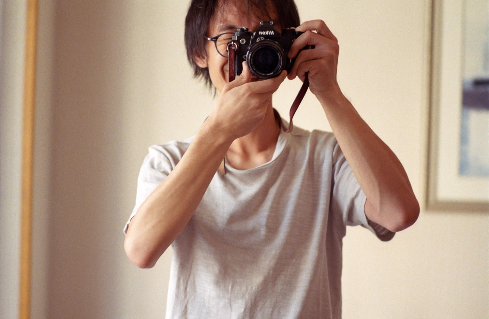

```{r setup, include=FALSE}
knitr::opts_chunk$set(echo = FALSE)
```



Charlie Gao is an artist using photography as an unbounded and non-specific concept.

Works explore how photography may be interpreted in the widest sense, as a practice that is itself performative and continuous in nature, a lived-in experience which sustains long-term habit and ritual. In this sense it is the motivations behind the photographer which are necessarily of paramount interest, with the camera and image secondary, confounding traditional notions of photography.

Residing in London and travelling regularly to Japan, the artist studied at Central Saint Martins, University of the Arts London, and holds an MA (Cantab) degree from Trinity College of the University of Cambridge.

--

### Contact

E-mail: < charlie.gao *using* shikokuchuo.net >

--

### Theory

The following text provides a skeleton theoretical framework underpinning the artist’s work and views on photography.

[📄 Exposing the light chamber: a note on photography](pdf/Exposing_the_light_chamber.pdf "View PDF")

