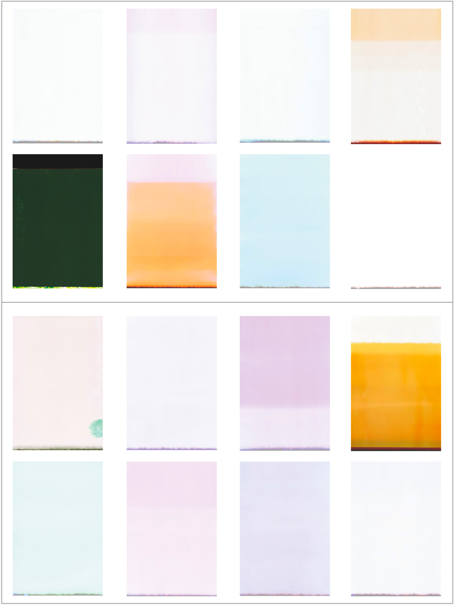

The title refers to a theory of modern cosmology that provides an explanation for the coherence that we actually experience in everyday life despite the randomness implications of quantum mechanics.

Akin to theories where infinite possible worlds branch out at each point in time, this theory instead posits that our history itself changes at each point in time.

Alluding to this concept, I scan the ends of the 35mm roll film used to create my other works.

There being no referent, it is only the pure intent of the photographer which is present.

This special arrangement was originally created for the photobook Tsuki, published 2016.

Although the title for this piece may now have acquired political connotations given the spread of 'fake news', with multiple narratives competing on the global stage on any number of issues, this was not something that would have been so readily apparent at the time.
